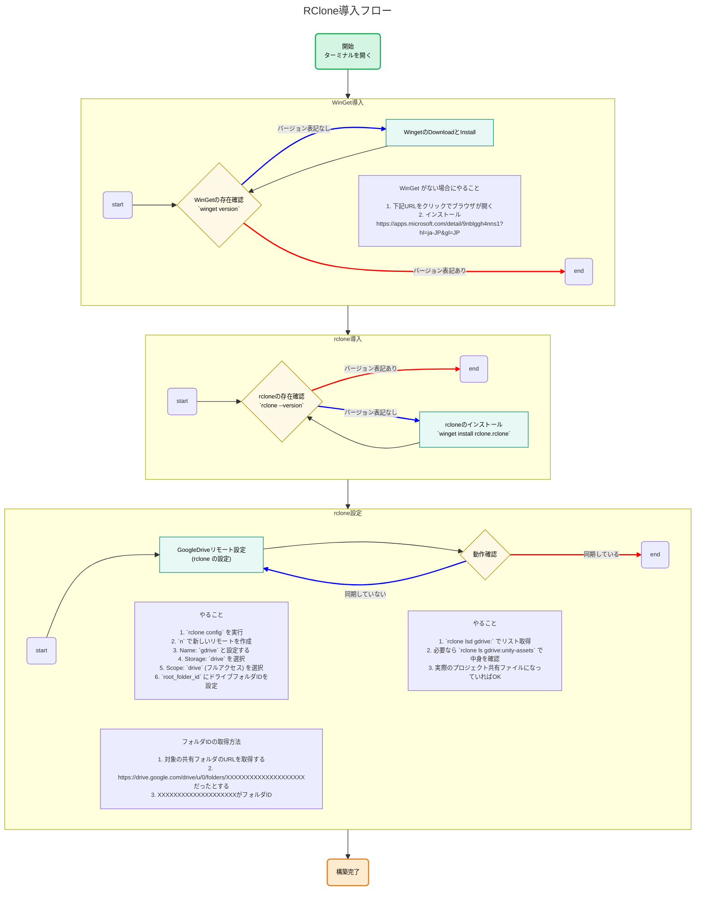

```mermaid
---
title: RClone導入フロー
config:
    theme:
    themeVariables:
        fontSize: 10px
---
flowchart TD
    %% --- classDef 定義 ---
    classDef startNode   fill:#d5f5e3,stroke:#27ae60,stroke-width:2px,color:black;
    classDef endNode     fill:#fdebd0,stroke:#e67e22,stroke-width:2px,color:black;
    classDef processNode fill:#e8f8f5,stroke:#148f77,stroke-width:1px,color:black;
    classDef checkNode   fill:#fef9e7,stroke:#b7950b,stroke-width:1px,color:black;

    %% --- 要素定義 ---
    Start("開始
        ターミナルを開く")

    subgraph G1[WinGet導入]
        direction LR
        S1Start(start)
        S1Check{"WinGetの存在確認
`winget version`"}
        S1Install[WingetのDownloadとInstall]
        S1Note["WinGet がない場合にやること

1. 下記URLをクリックでブラウザが開く
2. インストール
https://apps.microsoft.com/detail/9nblggh4nns1?hl=ja-JP&gl=JP"]

        S1End(end)

        S1Start --> S1Check
        S1Check -->|バージョン表記なし| S1Install
        S1Check --->|バージョン表記あり| S1End
        S1Install --> S1Check
        S1Check ~~~ S1Note
    end

    subgraph G2[rclone導入]
        direction LR
        S2Start(start)
        S2Check{"rcloneの存在確認
`rclone --version`"}
        S2Install["rcloneのインストール
`winget install rclone.rclone`"]

        S2End(end)

        S2Start --> S2Check
        S2Check -->|バージョン表記あり| S2End
        S2Check -- バージョン表記なし --> S2Install
        S2Install --> S2Check
    end

    subgraph G3[rclone設定]
        direction LR
        S3Start(start)
        S3Setting["GoogleDriveリモート設定
(rclone の設定)"]
        S3SettingNote["やること

1. `rclone config` を実行
2. `n` で新しいリモートを作成
3. Name: `gdrive` と設定する
4. Storage: `drive` を選択
5. Scope: `drive` (フルアクセス) を選択
6. `root_folder_id` にドライブフォルダIDを設定"]

        S3SettingNote1["フォルダIDの取得方法

1. 対象の共有フォルダのURLを取得する
2. https://drive.google.com/drive/u/0/folders/XXXXXXXXXXXXXXXXXXXXだったとする
3. XXXXXXXXXXXXXXXXXXXXがフォルダID"]
        S3Check{動作確認}
        S3CheckNote["やること

1. `rclone lsd gdrive:` でリスト取得
2. 必要なら `rclone ls gdrive:unity-assets` で中身を確認
3. 実際のプロジェクト共有ファイルになっていればOK"]

        S3End(end)

        S3Start --> S3Setting --> S3Check
        S3Start ~~~ S3SettingNote
        S3Start ~~~ S3SettingNote1
        S3SettingNote ~~~ S3CheckNote
        S3Check -->| 同期していない| S3Setting
        S3Check -->|同期している| S3End
    end

    Start --> G1 --> G2 --> G3 --> End(構築完了)

    linkStyle 1 stroke:blue,stroke-width:2px;
    linkStyle 2 stroke:red,stroke-width:2px;
    linkStyle 6 stroke:red,stroke-width:2px;
    linkStyle 7 stroke:blue,stroke-width:2px;
    linkStyle 14 stroke:blue,stroke-width:2px;
    linkStyle 15 stroke:red,stroke-width:2px;

    %% --- classDef の適用 ---
    class Start startNode
    class End endNode
    class S1Check,S2Check,S3Check checkNode
    class S1Install,S2Install,S3Setting processNode
    click S1Note href "https://apps.microsoft.com/detail/9nblggh4nns1?hl=ja-JP&gl=JP"

```
