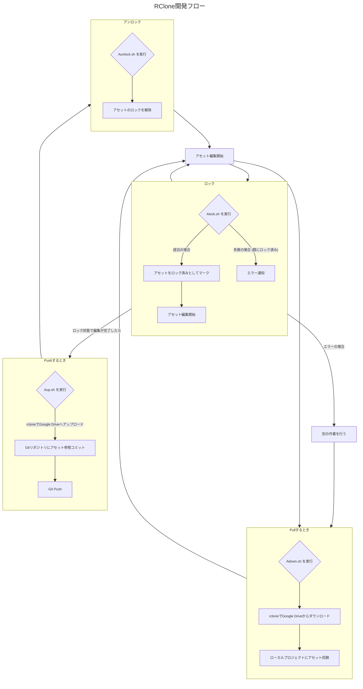

```mermaid
---
title: RClone開発フロー
config:
    theme:
    themeVariables:
        fontSize: 10px
---
graph TB
subgraph Adown[Pullするとき]
    direction TB
    G{Adown.sh を実行};
    G --> H[rcloneでGoogle Driveからダウンロード];
    H --> I[ローカルプロジェクトにアセット同期];
end

subgraph Aup[Pushするとき]
    direction TB
    B{Aup.sh を実行} -->|rcloneでGoogle Driveへアップロード| D[Gitリポジトリにアセット参照コミット]
    D --> E[Git Push];
end
subgraph Alock[ロック]
    direction TB
    L2{Alock.sh を実行};
    L2 -- 成功の場合 --> L3[アセットをロック済みとしてマーク];
    L2 -- 失敗の場合 (既にロック済み) --> L4[エラー通知];
    L4

    L3 --> L5[アセット編集開始];
end

subgraph Aunlock[アンロック]
    direction TB
    L7{Aunlock.sh を実行} --> L8[アセットのロックを解除];
end

L1[アセット編集開始]
R1[別の作業を行う]

L1 --> Alock
Alock --> L1
Alock -->|ロック状態で編集が完了したら| Aup
Aup --> Aunlock

Alock -->|エラーの場合| R1
Aunlock --> L1
R1 --> Adown
L1 --> Adown
Adown --> L1


```
